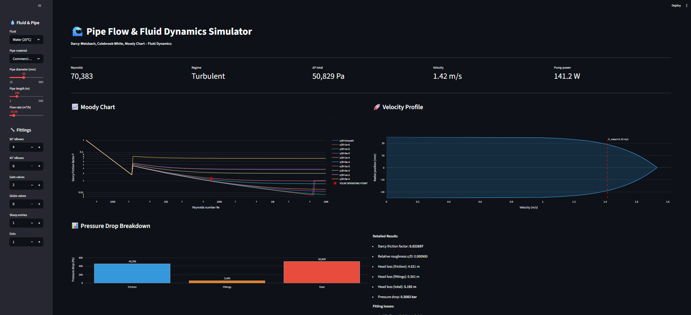
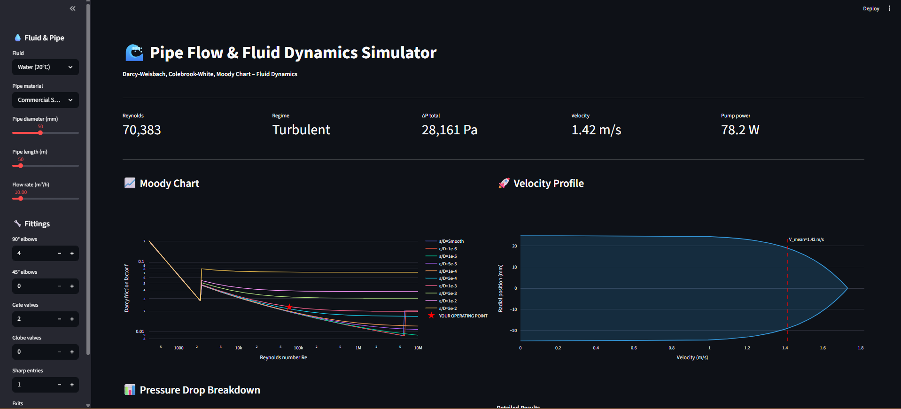
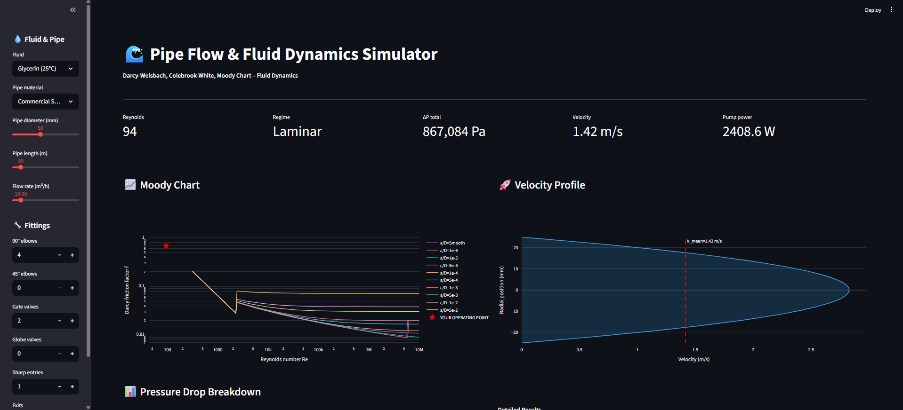

# 🌊 Pipe Flow & Fluid Dynamics Simulator
 

 
## Overview
Interactive pipe flow analysis using Darcy-Weisbach, Colebrook-White,
and Moody chart. 5 fluids, 7 pipe materials, 7 fitting types.
 
## 🔗 Live Demo
**[Open Simulator](https://your-url.streamlit.app)**
 
## Features
- Colebrook-White implicit friction factor solver
- Interactive Moody chart with operating point
- Velocity profiles (laminar parabolic / turbulent 1/7th)
- Major + minor loss breakdown (7 fitting types)
- Pump power calculation
 
### Moody Chart

 
### Laminar vs Turbulent

  
## Author
**Oscar Vincent Dbritto**
